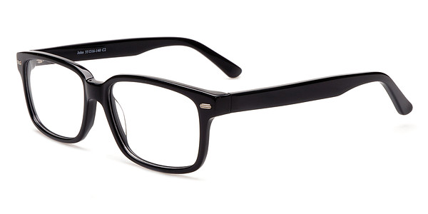
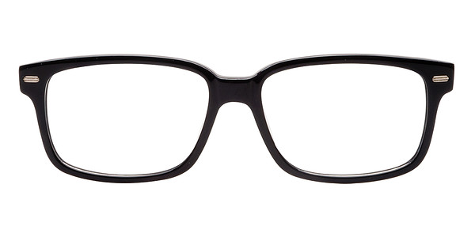
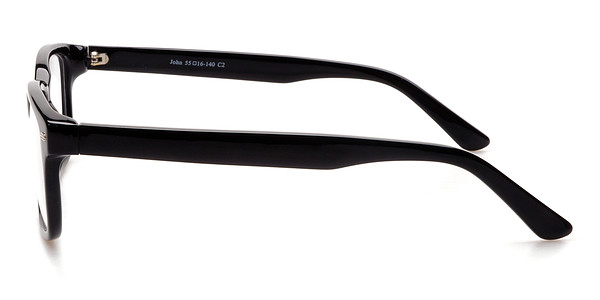
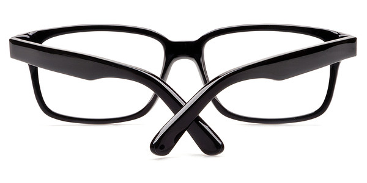

# slider
jquery.slider.js - `jQuery` plugin

------

#### 使用说明
##### 引入必要的文件，当然还需要 `jQuery` 库
```javascript
<link type="text/css" rel="stylesheet" href="slider.css" />
<script type="text/javascript" src="jquery.slider.js"></script>
```

##### 参数列表
|      参数名     |       类型       |         默认值         |     说明     |
| -------------- | ---------------- | --------------------- | ------------ |
| items          |     selector     |     li                | 滑动的元素 |
| border         |     integer      |     0                 | 元素的边框 |
| view           |     float        |     1                 | 每次可见的元素数量 |
| skip           |     float        |     1                 | 每次滑动的个数 |
| offset         |     float        |     0                 | 第一个可见元素的偏移量 |
| current        |     integer      |     0                 | 当前组 |
| loop           |     boolean      |     false             | 传统的循环效果，不连贯 |
| circle         |     boolean      |     false             | 循环效果，连贯 |
| auto           |     integer      |     0                 | 自动滑动的间隔时间 |
| speed          |     integer      |     300               | 滑动时间 |
| touch          |     boolean      |     true              | 是否支持触摸 |
| dynamic        |     object       |     {}                | 根据屏幕大小自动切换可见元素数量 |
| effect         |     string       |     slide             | 动态效果 slide、fade，fade 效果不能和 offset 共用 |
| previous       |     selector     |                       | 点击展示上一组 |
| next           |     selector     |                       | 点击展示下一组 |
| disabled_class |     string       |                       | 没有上一组、下一组需要添加的 class 名 |
| nav            |     selector     |                       | 点击展示某一组 |
| before         |     function     |     function() {}     | 每次滑动前执行的函数 |
| after          |     function     |     function() {}     | 每次滑动后执行的函数 |
| get_items      |     function     |     function() {}     | 和 item_template 配合使用，动态加载 items |
| item_template  |     function     |     function() {}     | 和 get_items 配合使用，动态加载 items |
| cloneAfter     |     function     |     function() {}     | 克隆元素后执行的函数 |
| initAfter      |     function     |     function() {}     | 初始化后执行的函数 |

##### 特点
- 设置为自动滑动，鼠标悬停停止滑动，鼠标移走继续自动滑动

##### 举例说明
```html
<div id="slider-box">
    <div id="slider-items">
        <ul>
            <li class="item">1</li>
            <li class="item">2</li>
            <li class="item">3</li>
            <li class="item">4</li>
        </ul>
    </div>
    <div id="slider-nav">
        <span class="current">1</span>
        <span>2</span>
        <span>3</span>
        <span>4</span>
    </div>
</div>
<a class="previous">Previous</a>
<a class="next">Next</a>
```

```javascript
$(document).ready(function() {
    $("#slider-items ul").slider({
        view: 1.6,
        skip: 1,
        offset: 0.3,
        loop: false,
        circle: true,
        auto: 1900,
        speed: 900,
        effect: 'slide',
        touch: true,

        previous: '.previous',
        next: '.next',
        nav: '#slider-nav span'
    });
});

$(window).resize(function() {
    setTimeout(function() {
        $("#slider-items ul").slider('resize');
    }, 1200);
});
```

------

#### 变更记录
##### 2015-05-21 Version 2.7
* add offset for slide effect

##### 2015-04-03 Version 2.6
* fix bug for clicking navigation
* when touch container, add speed to eliminate the delay effect

##### 2014-08-27 Version 2.5
* fix bug when loop = false and circle = false, it can also slide

##### 2014-06-03 Version 2.4
* not clone items, if item length < view

##### 2014-05-29 Version 2.3
* fix some bug, likes auto slide twice

##### 2014-05-15 Version 2.2
* add fade effect for slider

##### 2014-04-09 Version 2.1
* quickly click several times on previous and next selector, change the logic
* auto slide, mouse enter stop, mouse leave continue

##### 2014-03-18 Version 2.0
